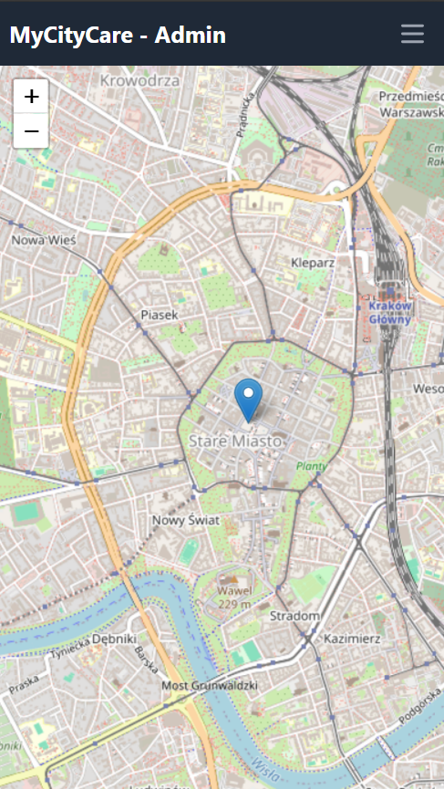
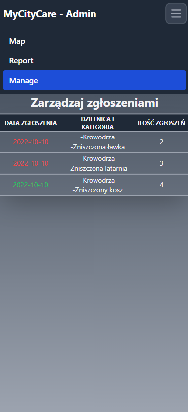
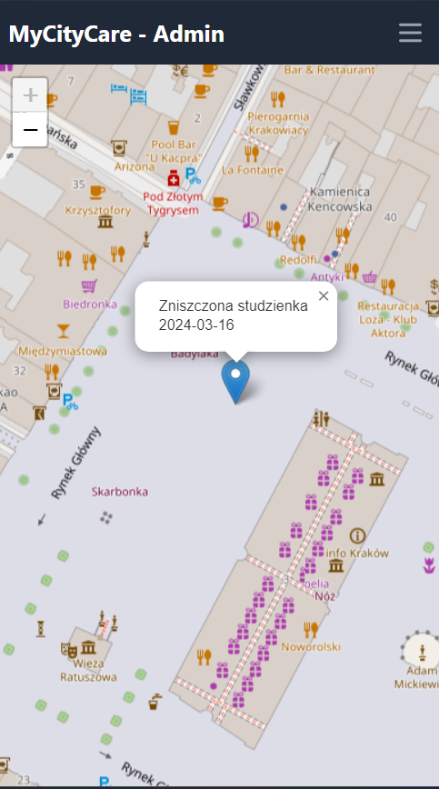
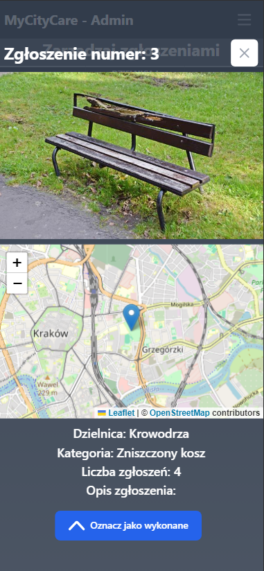
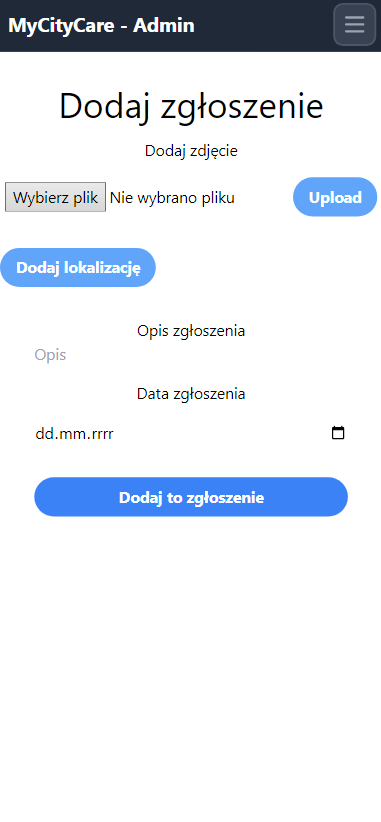
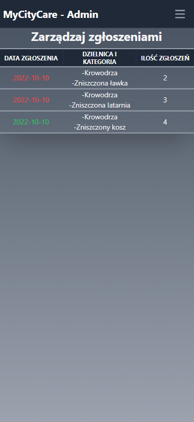

# MyCityCare

MyCityCare is an web application developed during the SWM Hackathon 2024, where it claimed the prestigious 2nd place. This application serves as a platform for citizens to submit various issues and concerns to their local governments, facilitating communication and problem-solving within cities.

 Despite its rapid development within a few hours, MyCityCare demonstrates its potential to streamline civic engagement and improve urban infrastructure by bridging the gap between citizens and authorities.

 

## Presentation

Presentation is availible at:

- [Canva link](https://www.canva.com/design/DAF_sfddJWk/9YMxHEkiKWCvvfzk1nYnAA/edit?utm_content=DAF_sfddJWk&utm_campaign=designshare&utm_medium=link2&utm_source=sharebutton)
- [Github pdf](./documentation/MyCityCare.pdf)

## Stack

Technologies used for this app:
- Frontend:
  - React.js
  - Tailwind
- Backend:
  - Python
  - Flask
- Databases:
  - AWS S3
  - MySql

## Gallery 
 
 

## Important
Due to privacy concerns, all credentials have been removed, rendering the application non-functional.
